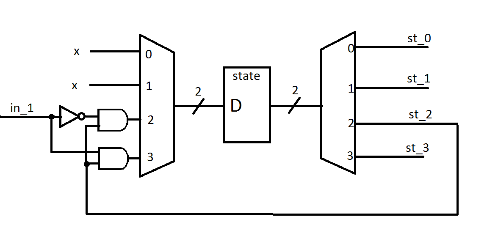

#Questions
##3.1 
Those two designs will lead to the same behaviour. In 3.7 wires with prefix `next_` are used to describe the drivers of flip-flop and state registry, and those drives change continuously with change of state or input signals, then after another `posedge clk` they are sampled into regs. If 3.6 would have used the state as condition for change of the output signals, the output signal would be late for a timer tick every time. Actually, the designs show the same behaviour due to the fact that `next_state` equals `STATE_1` in 3.6 assumes that at some point condition (`state` equals `STATE_0` and `in1&&!in2`) changes `next_state` to `STATE_1`, so it's identical to the behaviour of 3.7.
##3.2

##3.3 
The drop of frequency for binary-encoded FSM is caused by complex encode/decode combinational logic, which causes delay. One-hot encoding doesn't need to be encoded/decoded (the registry outputs are already formed as state signals) so FSM based on that encoding doesn't need encoder and decoder, thus disposing the delay and increasing maximum possible frequency. 
##3.4
Registered outputs prevent state machine from race conditions, glitches on machine outputs that burn unnecessary power and potentially causing invalid logic operations. Those problems are caused because clock skew toggles state registers at different times and mismatched signal-path lengths that vary propagation delays through output decoding logic.
##3.5
`full_case` allows the compiler to assume, that all case variants were listed and thus ensures that there will be no latches for missing case variants. `parallel_case` assumes that only one option from the condition list can be true, thus avoids priority logic from being generated.